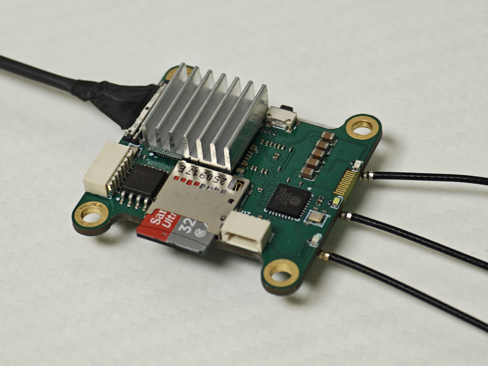
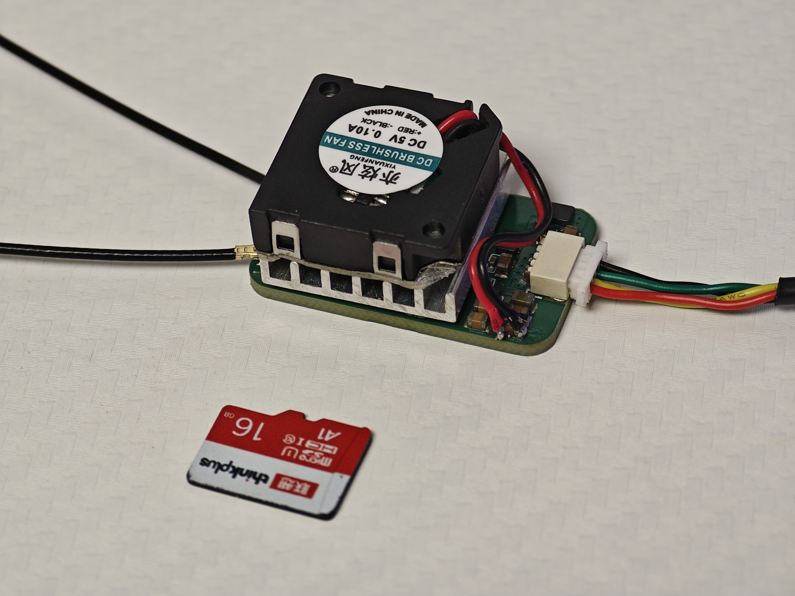
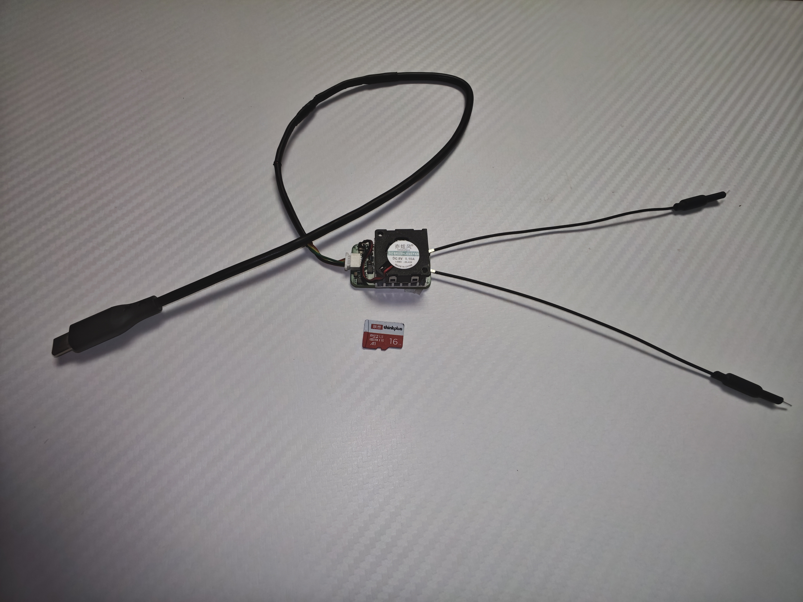
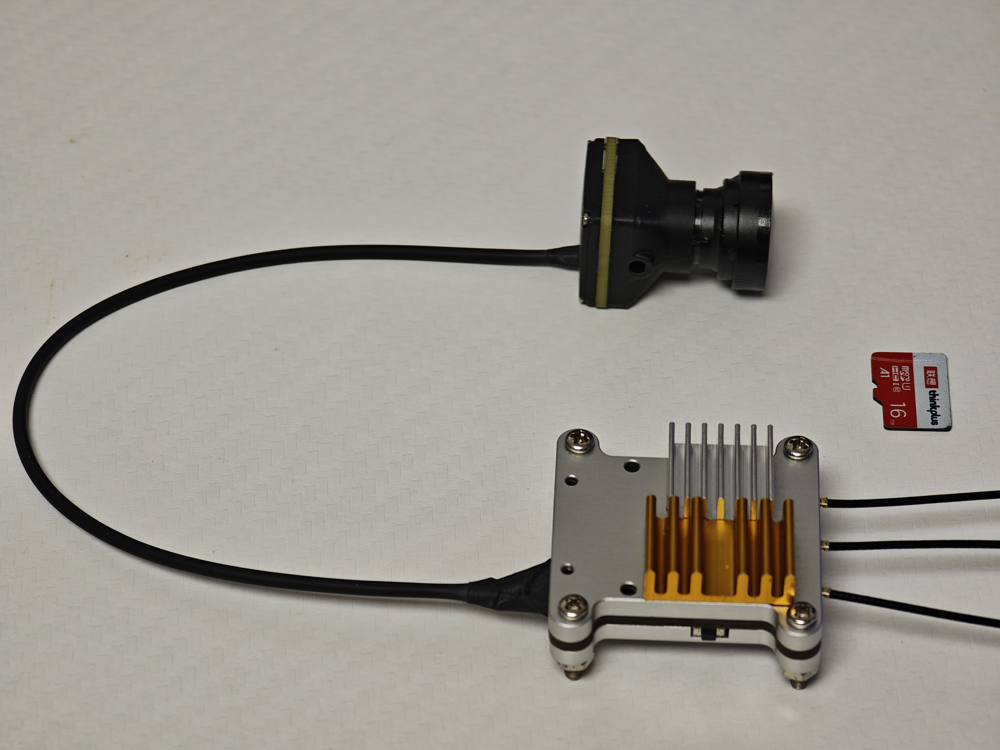
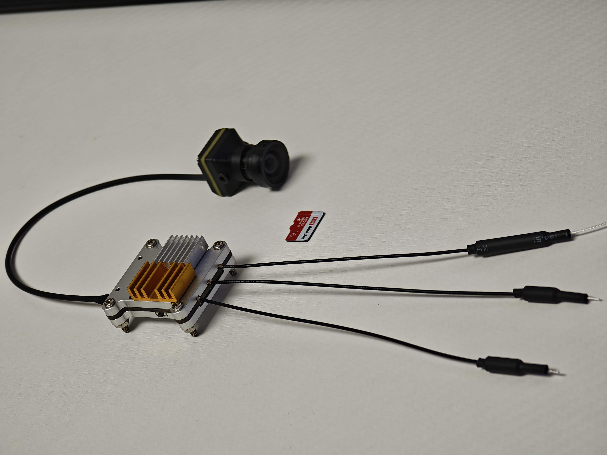
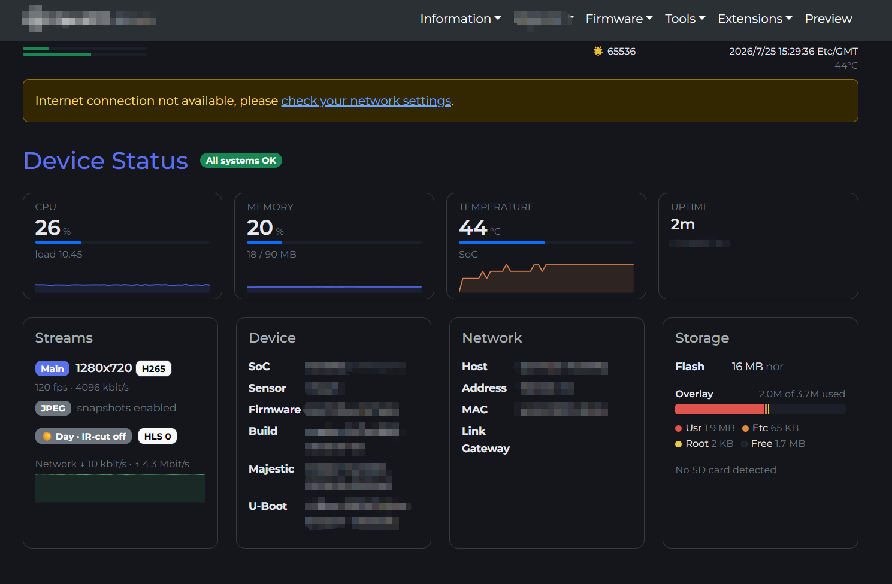
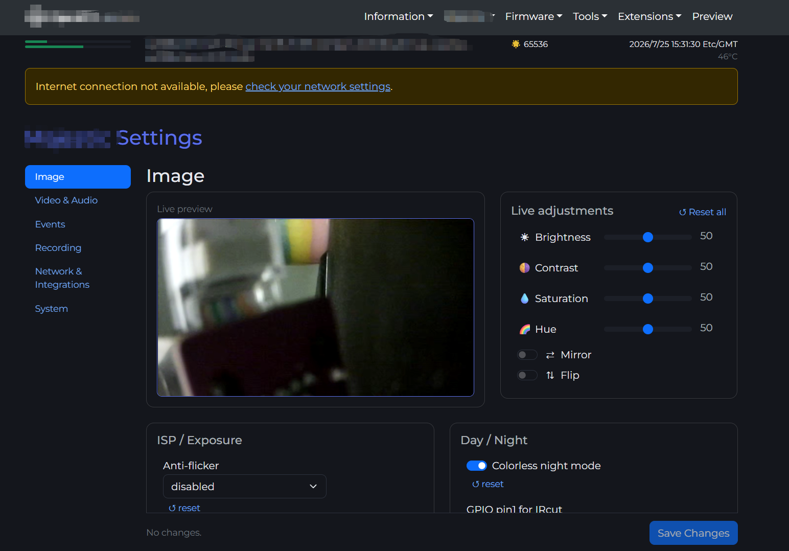
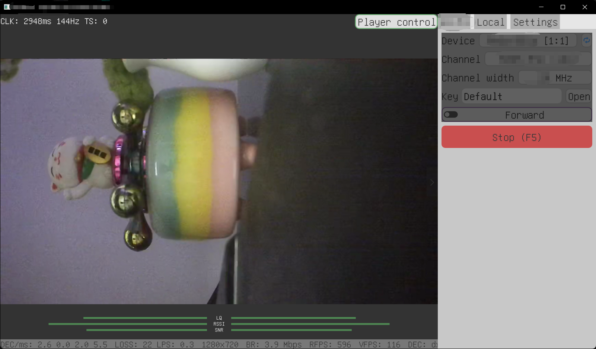
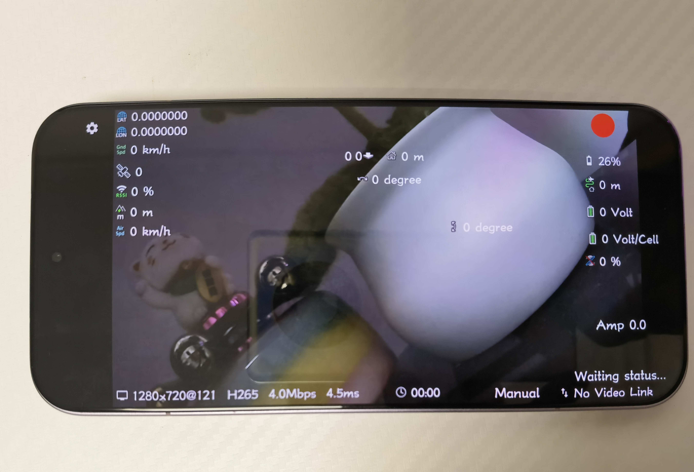
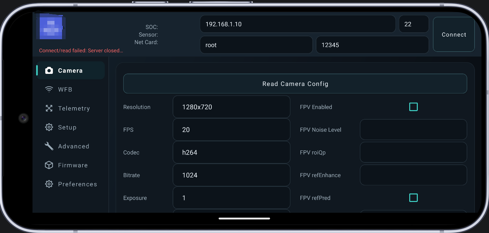

# 低延迟高清数字图传系统商业计划书

## 1. 执行摘要

本项目面向无人机、机器人、工业巡检、安防应急、赛事直播等场景，打造一套低延迟、高清、可定制、可规模化部署的数字图传系统。产品由机载/前端图传设备、地面/接收端设备、嵌入式固件、链路自适应算法、视频编码系统和配套管理软件组成，核心卖点是低延迟高清视频传输，以及围绕图传链路构建的强大软件能力。

项目基于轻量化嵌入式固件、视频编码、无线传输和设备管理等模块进行产品化开发，具备多硬件平台适配、视频编码、Web 管理、无线图传、链路自适应、远程配置和现场调试能力。相比传统模拟图传，数字图传具备更高画质、更强抗干扰能力、更好的软件扩展性和可管理性；相比高端封闭图传系统，本项目通过灵活架构、硬件适配和可定制软件降低客户导入成本。

项目采用“一个技术底座，三阶段商业化”的推进路径：第一阶段聚焦 FPV 标准版，通过电商和社群销售验证低延迟、高清和价格优势；第二阶段将同一套硬件平台包装成校园教学开发套件，通过 SDK、课程和竞赛指导形成服务收入；第三阶段在标准图传平台基础上为工业无人机、机器人和行业客户提供有限定制开发与维护服务。长期目标是成为面向低空经济、校园创新教育与边缘视觉设备的低延迟数字图传基础平台。

## 2. 项目背景与机会

### 2.1 行业背景

低空经济、无人机应用、移动机器人、应急通信和边缘视觉设备正在快速增长，实时高清视频传输成为大量场景的关键基础能力。客户不再只需要“看得到”，而是需要“低延迟、高清晰、可控制、可记录、可维护、可集成”的完整图传系统。

典型需求包括：

- 无人机飞控、FPV、巡检作业需要低延迟第一视角画面。
- 工业巡检和机器人远程操作需要稳定高清图像与链路状态反馈。
- 应急救援和安防布控需要快速部署、远距离、抗干扰的视频回传。
- 赛事直播、影视拍摄和训练系统需要更低成本的无线高清图传方案。
- 行业客户需要可二次开发、可私有化部署、可按项目定制的软件系统。

### 2.2 市场痛点

当前市场方案存在以下痛点：

- 模拟图传延迟低但画质差，抗干扰能力弱，无法承载复杂软件能力。
- 消费级数字图传体验较好但封闭度高，难以行业定制和深度集成。
- 工业级图传价格高，采购和维护成本高，中小客户导入门槛大。
- 通用网络摄像头延迟高，对移动无线弱链路场景适配不足。
- 很多系统只有硬件图传能力，缺乏链路监测、远程配置、日志诊断、安全认证、设备管理等配套软件。

### 2.3 项目机会

本项目的机会在于用轻量化固件、专用硬件平台和图传专用软件栈，构建兼具成本优势、低延迟能力和行业定制能力的数字图传系统。产品不只销售单一硬件，而是形成“设备 + 固件 + 管理软件 + 定制服务”的整体解决方案。

## 3. 产品定位

### 3.1 产品名称

产品名称：`AirLink HD` 低延迟高清数字图传系统。

后续可根据品牌策略调整为中文品牌名或行业版名称。

### 3.2 产品一句话定位

面向无人机、机器人和行业视觉设备的低延迟高清数字图传系统，以高清实时视频为核心，以链路自适应和软件管理能力为差异化优势。

### 3.3 核心价值主张

- 低延迟：面向实时操控场景优化视频编码、传输链路和播放链路。
- 高清晰：支持 1080p 及更高规格的视频编码能力，兼顾码率、帧率和画质。
- 低接收成本：支持使用智能手机作为接收端，显著降低整套系统购买门槛。
- 强链路：通过链路自适应在不同距离和干扰环境下动态调整传输参数。
- 强软件：提供 Web 管理、参数配置、认证、日志、链路状态、升级维护和行业定制能力。
- 易集成：基于标准接口和可配置软件架构，便于与飞控、机器人平台、上位机、调度平台集成。
- 成本可控：采用芯片级方案自研设计，核心图传模块、电源、接口和无线相关电路均由团队自主设计，不依赖成品模块采购，具备模块单独设计、生产和迭代能力，从而在 BOM、尺寸、接口和供应链上保持主动权。

## 4. 产品方案

### 4.1 系统组成

完整系统由以下部分组成：

- 前端图传设备：摄像头模组、视频处理主控、无线通信模块、天线、电源管理、散热结构。
- 接收端设备：地面端接收模块、无线网卡/射频模块、解码/显示设备、USB/HDMI/以太网输出扩展。
- 轻量接收模式：在部分应用场景下，客户可不采购专用接收端，直接使用具备无线连接能力的手机或 PC 接收图传画面。
- 嵌入式固件：轻量化系统，适配多类视频处理硬件和图像传感器。
- 视频编码系统：负责图像处理、视频编码、码率、帧率、关键帧和图像参数控制。
- 无线图传链路：基于低延迟无线传输技术实现视频单向/双向传输。
- 链路自适应模块：根据信号质量、干扰情况和传输质量等指标动态切换传输策略。
- Web 管理系统：提供登录认证、配置管理、状态监控、日志查看、升级维护等功能。
- 上位机/行业软件：提供接收显示、录像、设备管理、链路监控、远程运维、SDK/API 等能力。

### 4.2 核心功能

- 实时高清视频传输：支持主码流高清传输，面向 1080p、高清高帧率等场景优化。
- 低延迟编码配置：支持 CBR、GOP、帧率、码率、关键帧等参数调优。
- 链路自适应：根据地面端接收质量切换无线链路参数、冗余策略、带宽、发射功率和视频码率。
- 弱网保底模式：链路变差时自动降低码率并提高冗余，避免画面突然完全中断。
- Web 配置与认证：提供浏览器管理入口、登录认证和会话管理。
- 灵活接收模式：支持专用接收端模式和手机/PC 直连模式；后者延迟和通信距离相对下降，但可进一步降低低预算客户的系统采购门槛。
- 远程维护：支持参数下发、日志诊断、配置导出、固件升级等运维能力。
- 行业定制：可按客户需求增加画面信息叠加、遥测叠加、私有协议、云平台对接、加密认证等能力。

### 4.3 技术基础

当前已具备以下产品化基础：

- 轻量化嵌入式固件框架：适合摄像头和图传设备定制。
- 视频服务模块：支持视频编码、图像参数、码率、帧率、关键帧、画面叠加和音频等配置。
- 低延迟无线图传组件：面向 FPV/图传场景的视频传输。
- 链路自适应模块：通过地面端统计和前端策略切换实现链路自适应。
- Web 管理模块：适合资源受限设备的登录认证和配置管理。
- 多硬件平台扩展基础：为后续多规格产品提供适配基础。

### 4.4 产品形态

初期形成三类产品形态，但不同时重投入推进，而是按阶段验证和放大：

| 阶段     | 产品形态   | 目标客户                         | 交付内容                                           | 收入方式                         |
| -------- | ---------- | -------------------------------- | -------------------------------------------------- | -------------------------------- |
| 第一阶段 | FPV 标准版 | 民用 FPV/航模玩家                | 前端图传模块、接收端、天线、标准固件、安装说明     | 硬件销售                         |
| 第二阶段 | 校园教学版 | 高校、竞赛团队、实验室           | 硬件套件、教学 SDK、课程视频、实验文档、示例项目   | 硬件成本价 + 技术课程/指导服务   |
| 第三阶段 | 行业定制版 | 工业无人机、机器人、行业项目客户 | 标准硬件、定制固件、上位机接口、私有协议、现场调试 | 项目制开发 + 维护服务 + 批量供货 |

产品化原则：

- FPV 标准版用于获取真实用户、实测反馈和早期现金流。
- 校园教学版用于建立教学场景、开发者生态和可复制课程服务。
- 行业定制版只围绕低延迟图传平台做有限定制，避免变成无边界软件外包。
- 接收端采用分层方案：对延迟和距离要求高的客户使用专用接收端，对预算敏感或距离要求较低的客户提供手机/PC 直连使用方式。

## 5. 目标客户与应用场景

### 5.1 目标客户

- 无人机整机厂和无人机行业应用公司。
- FPV 与航模核心玩家、赛事团队、训练机构。
- 巡检机器人、消防机器人、履带机器人、无人车厂商。
- 安防、应急、园区巡检等行业集成商。
- 影视、直播、活动拍摄等对低成本无线图传有需求的团队。
- 高校、实验室、创客团队和视觉 AI 设备开发者。

### 5.2 优先落地场景

第一阶段优先选择验证周期短、采购决策快、对低延迟敏感的 FPV 民用场景；校园和行业方向以试点、合作和样板项目方式推进，避免初创阶段资源过度分散。

| 优先级     | 场景                       | 目标                           | 当前策略                             |
| ---------- | -------------------------- | ------------------------------ | ------------------------------------ |
| 第一优先级 | FPV 数字图传升级           | 验证低延迟、高清、价格和稳定性 | 电商渠道/社群销售标准版硬件          |
| 第二优先级 | 高校竞赛与创新教育         | 建立教学平台和开发者生态       | 与高校教师合作，准备 SDK、课程和文档 |
| 第三优先级 | 工业无人机和机器人项目     | 承接高价值有限定制需求         | 通过产学研合作和行业项目试点进入     |
| 延伸场景   | 巡检、应急、安防、影视直播 | 扩展行业案例                   | 在标准平台成熟后选择性推进           |

### 5.3 场景价值

- 对无人机客户：提升操控体验和任务安全性，降低封闭图传系统成本。
- 对机器人客户：提供低延迟视觉闭环，改善远程操作和故障处理效率。
- 对行业集成商：提供可定制底座，缩短项目交付周期。
- 对开发者客户：提供接口和开发支持，降低二次开发门槛。

## 6. 市场规模与趋势

低延迟高清图传属于低空经济、机器视觉、边缘设备和工业无线通信的交叉领域。随着无人机和机器人从消费娱乐向行业应用扩展，视频链路正在从单纯画面传输升级为设备控制、数据采集、远程运维和智能分析的基础设施。

项目可切入的市场包括：

- FPV 与航模图传市场。
- 无人机行业应用配套市场。
- 移动机器人远程操控市场。
- 工业和安防无线视频回传市场。
- 边缘摄像头固件和软件定制服务市场。

短期不直接与高端品牌在全规格上竞争，而选择“成本敏感、需要定制、需要开放接口、项目交付周期短”的细分客户切入，逐步建立口碑和行业案例。

## 7. 竞争分析

### 7.1 竞争类型

- 模拟图传：延迟低、成本低，但画质和软件能力不足。
- 消费级数字图传：体验好、生态成熟，但封闭、价格高、定制难。
- 工业级专用图传：稳定性强，但采购成本高、开发周期长。
- 普通 IP 摄像头方案：成本低、生态成熟，但端到端延迟高，不适合强实时操控。
- 自研无线视频方案：可控性强，但研发门槛高、周期长、稳定性难保障。

### 7.2 差异化优势

- 软件定义图传：不仅传视频，还能管理链路、调整编码、监控质量、维护设备。
- 开放可定制：客户可以按硬件、频段、接口、平台协议进行定制。
- 整套成本优势：竞品通常需要搭配专用眼镜形成完整使用闭环，本项目支持专用接收端、智能手机或 PC 等多种接收方式；在轻量场景下，客户仅采购图传发送端即可使用，显著降低整套系统门槛。
- 接收方式灵活：专用接收端用于低延迟和远距离场景，手机/PC 直连用于预算敏感、距离较短或实时性要求较低的场景，形成更宽的客户覆盖范围。
- 低延迟优势：当前方案目标/测试延迟约 16ms，低于已整理竞品的 20ms-22ms 延迟水平，并通过实测视频和测试方法说明支撑。
- 快速迭代：固件和软件可持续升级，适合项目制客户不断调整需求。

### 7.3 竞争壁垒

- 低延迟端到端调优能力：围绕采集、编码、无线传输、接收、解码和显示链路进行整体优化，而不是只优化单个模块。
- 低延迟测试体系：通过可重复的延迟测试方法、测试素材和数据记录，持续量化端到端延迟、抖动和弱链路表现。
- 低延迟参数积累：针对不同分辨率、帧率、码率、关键帧策略和链路质量沉淀场景参数方案，形成可复用调参经验。
- 芯片级硬件方案和模块电路自主设计能力，不依赖成品图传模块采购，为低延迟链路、电源、接口和结构优化提供硬件基础。
- 多硬件平台适配和供应链筛选能力，使低延迟方案可以在不同成本和规格档位上复制。
- 现场问题定位、日志诊断和远程运维能力，用于保障低延迟系统在真实环境中的稳定交付。

### 7.4 竞品对比表

以下表格用于对比不同图传方案的成本、体验和可开发能力。本项目参数以实测视频、测试方法和测试环境说明作为支撑。

| 对比对象                  |        模块价格 |                           完整使用成本 | 视频规格                                    |     延迟 | 接收端/生态               | 二次开发                | 本项目切入点                                                               |
| ------------------------- | --------------: | -------------------------------------: | ------------------------------------------- | -------: | ------------------------- | ----------------------- | -------------------------------------------------------------------------- |
| DJI O4 Lite               |       约 850 元 |                    约 2500-4500 元以上 | 1080p@100Hz，最高支持 4K@60                 |  约 20ms | 需搭配 DJI 专用眼镜       | 不支持                  | 竞品体验强但整套成本高、生态封闭，本项目以低延迟、手机接收和低整套成本切入 |
| CADDX Walksnail Avatar GT |       约 900 元 |                         约 3700 元以上 | 1080p@120fps                                |  约 22ms | 需搭配 Walksnail 专用眼镜 | 不支持                  | 竞品高清体验较好但完整系统价格高，本项目降低接收端门槛并保留可开发能力     |
| 本项目 FPV 标准版         | 计划 599-799 元 | 可选专用接收端；轻量场景可仅采购发送端 | 高清数字图传，具体分辨率/帧率以量产配置为准 |  约 16ms | 支持专用接收端、手机或 PC | 支持 SDK/教学和行业定制 | 以更低整套成本、更低延迟、灵活接收和可二次开发能力切入 FPV、校园和行业项目 |
| 模拟图传                  |         100-300 |                         接收端400-1500 | 标清/低清为主，多为480P或360P               |    <10ms | 接收生态成熟              | 弱                      | 本项目用数字高清和软件能力替代模拟图传画质短板                             |
| 普通 IP 摄像头            |            较低 |                                   较低 | 高清                                        | 通常较高 | 手机/电脑可接收           | 较强                    | 本项目面向实时操控场景优化端到端延迟                                       |

竞品跟踪数据：公开售价、重量、功耗、传输距离、抗干扰表现、售后/维修成本、不同配置下的完整套装价格。

## 8. 商业模式

本项目采用“硬件销售 + 教学服务 + 有限定制开发”的组合收入模式。早期不追求三个市场同时做大，而是用不同市场承担不同任务：FPV 市场验证产品和价格，校园市场建立教学平台和开发者生态，行业定制市场提升客单价和技术壁垒。

### 8.1 第一阶段：FPV 电商硬件销售

目标客户：民用 FPV 航模玩家、DIY 无人机用户、对低延迟和价格敏感的玩家。

客户需求排序：

1. 低延迟。
2. 画质清晰。
3. 价格可接受。
4. 设备轻量、易安装、易替换。

销售方式：

- 通过主流电商渠道销售标准硬件套装。
- 通过垂直社群、内容平台和用户社区发布实测视频、安装教程和画面对比。
- 提供标准化说明书、常见问题文档、基础售后和必要固件升级。
- 面向个人用户提供标准化产品和基础售后，深度定制需求由校园版或行业版承接。

商业逻辑：

- 该方向以硬件销售为主，用低延迟和价格优势吸引早期用户。
- FPV 模块在高频训练、意外损坏和性能升级过程中存在替换需求，具备复购可能。
- 个人用户市场可为后续产品迭代提供真实使用反馈、故障样本和口碑素材。

### 8.2 第二阶段：校园教学开发平台

目标客户：高校、实验室、竞赛团队、创新创业课程、嵌入式/无人机/机器人教学场景。

当前基础：已建立高校合作沟通基础，计划以区域高校试点方式，围绕竞赛和课程场景推广图传教学开发套件。

收入分层：

| 产品层级      | 交付内容                    | 付费方             | 商业作用                 |
| ------------- | --------------------------- | ------------------ | ------------------------ |
| 基础套件      | 硬件 + 入门文档             | 学生团队、实验室   | 降低使用门槛，扩大装机量 |
| 教学资源包    | SDK + 实验指导书 + 课程视频 | 教师、学院、实验室 | 形成标准化服务收入       |
| 竞赛/项目指导 | 训练营、答疑、项目辅导      | 竞赛团队、课题组   | 提高客单价和复购率       |

商业逻辑：

- 硬件接近成本价销售，降低高校和学生团队采购门槛。
- 收入重点来自技术指导课程、培训服务、项目辅导和教学资源包。
- 校园市场不只是卖货，而是建立低延迟图传教学开发平台和开发者生态。

### 8.3 第三阶段：行业有限定制开发

目标客户：工业无人机、巡检机器人、应急通信、安防巡检、行业集成商和产学研联合项目。

收入来源：

- 项目制开发费用。
- 技术服务和现场调试费用。
- 维护升级费用。
- 后续批量供货或 OEM/ODM 合作。

定制边界：

- 定制开发聚焦低延迟图传平台相关能力，避免偏离核心产品方向的泛软件外包。
- 优先选择能沉淀为通用模块的需求，例如协议对接、画面信息叠加、链路增强、上位机接口、远程管理和日志诊断。
- 每个定制项目都应尽量反哺标准产品，形成可复用模块和行业案例。

### 8.4 收入组合

| 收入类型       | 对应市场             | 特点                         |
| -------------- | -------------------- | ---------------------------- |
| 硬件销售       | FPV、电商、标准套装  | 回款快、验证市场、形成出货量 |
| 技术课程       | 高校、竞赛团队       | 毛利较高、可复制、增强生态   |
| SDK/教学资源包 | 高校、开发者         | 可标准化交付                 |
| 定制开发       | 工业无人机、项目客户 | 客单价高、需求复杂、壁垒强   |
| 维护服务       | 行业客户             | 持续收入、增强客户黏性       |

## 9. 产品路线图与当前进展

### 9.1 第一阶段：FPV 标准版验证

目标周期：0 到 4 个月。

关键任务：

- 完成前端图传样机和地面接收端样机。
- 固化 1080p 低延迟视频传输基础配置。
- 完成链路自适应策略的初版调优。
- 完成 Web 管理页面的基础产品化。
- 建立延迟、距离、码率、丢包、温升、功耗测试流程。
- 完成样机迭代、小批量试制和基础可靠性验证。
- 输出 FPV 标准版硬件套装、安装教程和演示材料。
- 准备电商商品页、常见问题文档、基础说明书和社群推广素材。

阶段成果：可演示、可试用、可小批量试销验证的 FPV 标准版产品。

### 9.2 第二阶段：校园教学版推广

目标周期：4 到 9 个月。

关键任务：

- 基于首批用户反馈优化硬件外壳、电源、散热和天线方案。
- 打磨教学 SDK、示例项目、课程视频和实验指导书。
- 面向高校竞赛和创新课程形成教学开发套件。
- 推进区域高校试点合作。
- 增强链路状态可视化、日志诊断和参数配置能力。
- 建立小批量供应链、生产测试和售后流程。

阶段成果：形成可教学、可二次开发、可复制推广的校园教学版产品。

### 9.3 第三阶段：行业有限定制与平台化

目标周期：9 到 18 个月。

关键任务：

- 围绕工业无人机、机器人和行业项目承接有限定制需求。
- 将协议对接、画面信息叠加、远程管理、日志诊断等需求沉淀为通用模块。
- 在标准产品稳定后推出多 SKU 产品线，覆盖不同距离、画质、接口和成本档位。
- 逐步建立设备管理平台、授权系统和远程运维系统。
- 引入加密传输、权限管理、安全审计等行业能力。
- 完成关键认证和稳定性测试。
- 建立渠道合作和 OEM/ODM 合作模式。

阶段成果：形成稳定营收产品线、可复用软件模块和可复制行业解决方案。

### 9.4 当前进展

| 进展方向   | 当前状态                                                              |
| ---------- | --------------------------------------------------------------------- |
| 技术基础   | 已形成嵌入式固件、视频编码、无线传输、链路自适应和 Web 管理等技术积累 |
| 样机验证   | 前端图传样机、接收方案和交互形态正在推进验证                          |
| 测试体系   | 低延迟、画质、传输距离、温升、功耗和弱链路表现等测试流程正在建立      |
| 校园合作   | 已建立高校合作沟通基础，计划围绕竞赛和课程场景推进区域试点            |
| 商业化准备 | 标准硬件套装、说明书、常见问题文档、渠道素材和社群推广内容正在准备    |
| 行业拓展   | 围绕无人机、机器人和行业项目持续跟进场景需求与样板项目机会            |

### 9.5 硬件样机与系统形态

当前硬件系统按功能可分为摄像头前端、图传主控和接收端设备三部分，均围绕低延迟图传场景进行自主设计和样机验证。

摄像头前端样机：

图传主控样机：

接收端设备样机：

早期系统联调样机：

## 10. 软件系统规划与进展

配套软件是本项目区别于普通图传硬件的核心组成部分。

### 10.1 嵌入式 Web 管理

- 登录认证与会话管理。
- 视频参数配置：分辨率、帧率、码率、编码策略、关键帧间隔、图像参数。
- 链路参数配置：无线链路策略、冗余策略、带宽、发射功率、场景参数方案。
- 设备状态：温度、电压、CPU、内存、无线质量、码率、丢包。
- 日志与诊断：运行日志、链路日志、异常状态、配置导出。
- 固件升级：本地升级、远程升级、配置备份与恢复。

嵌入式 Web 管理界面示例：

### 10.2 地面端软件

- 实时视频预览。
- 链路质量曲线和告警。
- 录像、截图、回放。
- 地面站画面叠加显示支持。
- 遥测数据叠加。
- 参数下发和远程控制。

电脑端地面站界面示例：

移动端地面站界面示例：

### 10.3 行业平台能力

- SDK/API 对接。
- 私有协议适配。
- 用户和权限管理。
- 设备资产管理。
- 任务记录和数据留存。
- 私有化部署和客户平台集成。

## 11. 运营计划

### 11.1 团队配置

初期团队配置：

- 嵌入式/固件工程师：负责嵌入式固件、驱动、系统裁剪、启动流程和稳定性。
- 视频/图像工程师：负责 ISP、编码参数、延迟优化和画质调优。
- 无线链路工程师：负责无线传输策略、冗余机制、链路参数、天线、距离和抗干扰测试。
- 前端/上位机工程师：负责 Web 管理、地面端软件和平台功能。
- 硬件工程师：负责板卡、电源、射频、结构、散热和生产测试。
- 产品/售前工程师：负责客户需求、方案文档、样机验证交付和项目管理。

### 11.2 供应链与生产

- 坚持芯片级方案和自主电路设计路线，不依赖成品图传模块采购。
- 围绕视频处理、无线通信、电源、接口和结构建立模块级设计、打样和小批量生产能力。
- 优先选择供应稳定、可长期采购的核心器件方案。
- 建立关键物料双供应商策略，降低缺货风险。
- 建立生产烧录、参数校准、链路测试、老化测试流程。
- 标准版产品统一外壳、天线、电源和接口，降低售后复杂度。

### 11.3 质量与测试

重点测试指标包括：

- 端到端延迟。
- 视频清晰度和码率稳定性。
- 有效传输距离。
- 抗干扰能力。
- 丢包恢复能力。
- 长时间运行稳定性。
- 温升和功耗。
- 固件升级可靠性。
- 弱链路下的降级策略。

## 12. 财务假设

本节基于当前样机方案、目标物料成本和小批量生产假设进行测算，量产阶段将结合实际 BOM、生产报价、试产良率、售后数据和客户订单滚动修正。

### 12.1 成本结构

- 硬件 BOM：视频处理芯片组、射频芯片组、摄像头镜头及传感器芯片组、天线、线材、外壳和基本元器件。
- 制造成本：贴片、组装、测试、烧录、包装。
- 研发成本：固件、视频算法、链路优化、Web/上位机软件、测试设备。
- 销售成本：样机、展会、演示材料、推广广告。
- 售后成本：技术支持、维修换新、版本维护。

本计划书中的硬件毛利率按完整单套交付成本测算，成本口径包括 BOM、PCB/SMT/组装、烧录测试、包装物流和售后预留；研发、市场和管理费用不计入单套毛利成本，而作为期间费用单独核算。

### 12.2 毛利目标

- FPV 标准版：初步估算 BOM 为 200-300 元，完整单套交付成本约 320-620 元；计划采用 599-799 元价格区间，主力价格带约 699 元，目标硬件毛利率约 30%-40%。首批可设置限量尝鲜价，长期价格围绕完整交付成本和目标毛利率动态调整。
- 校园教学版：硬件可接近成本价销售，毛利主要来自 SDK、课程、文档、培训和竞赛指导服务。
- 行业定制版：目标综合毛利高于标准硬件销售，收入包含定制开发、现场调试、维护升级和批量供货。
- 软件授权和维护服务：长期毛利高于硬件销售，是未来提升收入质量的关键。

### 12.3 单套产品测算

| 项目         | FPV 标准版                         | 校园教学版                             | 行业定制版                     |
| ------------ | ---------------------------------- | -------------------------------------- | ------------------------------ |
| 硬件 BOM     | 200-300 元                         | 参考 FPV 标准版，按教学配置调整        | 按项目配置                     |
| 完整交付成本 | 320-620 元                         | 接近成本价交付，需课程服务覆盖支持成本 | 按项目配置                     |
| 计划售价     | 599-799 元，主力价格带约 699 元    | 硬件接近成本价                         | 项目制报价                     |
| 主要毛利来源 | 硬件差价                           | 课程/SDK/指导服务                      | 定制开发/维护服务              |
| 售后成本     | 已计入完整交付成本预留，试产后修正 | 中等，需文档标准化                     | 较高，需项目服务费覆盖         |
| 关键验证指标 | 销量、退换货率、用户反馈、复购率   | 试点学校数、课程付费数                 | 项目金额、交付周期、复用模块数 |

FPV 标准版毛利率测算参考：

|   售价 | 完整交付成本 320 元 | 完整交付成本 450 元 | 完整交付成本 620 元 |
| -----: | ------------------: | ------------------: | ------------------: |
| 499 元 |            约 35.9% |             约 9.8% |           约 -24.2% |
| 599 元 |            约 46.6% |            约 24.9% |            约 -3.5% |
| 699 元 |            约 54.2% |            约 35.6% |            约 11.3% |
| 799 元 |            约 59.9% |            约 43.7% |            约 22.4% |

### 12.4 收入预测框架

收入模型按以下方式建立：

| 阶段      | 产品形态   | 关键指标                                   | 收入目标                     |
| --------- | ---------- | ------------------------------------------ | ---------------------------- |
| 0-4 个月  | FPV 标准版 | 样机数量、实测数据、首批用户反馈、电商试销 | 以产品验证和用户反馈为主     |
| 4-9 个月  | 校园教学版 | 试点高校数、课程包数量、SDK 使用反馈       | 形成教学服务收入和开发者生态 |
| 9-18 个月 | 行业定制版 | 项目线索数、项目金额、复用模块数、维护服务 | 形成高客单价项目收入         |

## 13. 融资与资源需求

### 13.1 融资用途

本轮计划寻求种子轮/天使轮资金与产业资源支持，资金主要用于：

- 样机开发和硬件迭代。
- 视频和无线链路测试设备采购。
- 小批量试产和库存准备。
- 核心研发人员投入。
- 行业样板项目交付。
- 市场推广、演示样机和渠道建设。

### 13.2 资源需求

- 无人机、机器人、安防行业试点客户。
- 硬件供应链和生产测试合作伙伴。
- 无线射频和天线测试资源。
- 行业渠道和集成商合作资源。
- 资金支持用于完成从样机到小批量交付的跨越。

## 14. 风险与应对

### 14.1 技术风险

风险：低延迟、高清、远距离和稳定性之间存在权衡。

应对：建立分场景参数策略，明确不同场景下的产品适用边界和可测试指标。

### 14.2 供应链风险

风险：视频处理主控、传感器、无线通信模块供货不稳定。

应对：多平台适配，保留替代物料，优先选择供应稳定的成熟方案。

### 14.3 合规风险

风险：无线频段、发射功率和行业应用可能涉及法规限制。

应对：区分开发测试版和合规量产版，针对目标市场进行认证和参数限制。

### 14.4 市场风险

风险：高端封闭品牌已有客户认知，低端市场价格竞争激烈。

应对：第一阶段通过实测视频、价格优势和标准化售后切入 FPV 早期用户；第二阶段通过校园教学服务和 SDK 建立差异化；第三阶段通过行业有限定制提升客单价，避免长期陷入纯硬件价格战。

### 14.5 第三方组件与知识产权风险

风险：产品化过程中涉及第三方软硬件组件、接口协议和品牌标识，需要控制知识产权与商业合规风险。

应对：梳理第三方组件授权边界，建立版权声明、供应链合规、商业模块隔离和产品命名规范。

### 14.6 个人用户售后风险

风险：FPV 玩家动手能力差异较大，电商硬件销售可能出现安装问题、误用损坏、退换货和用户评价风险。

应对：标准版产品明确安装边界、使用边界和质保范围；提供安装视频、常见问题文档、标准化固件升级和基础售后；将个性化改机和深度定制需求引导至校园版或行业版服务体系。

### 14.7 校园付费转化风险

风险：高校合作资源不等于实际订单，课程服务的付费方和采购流程可能不清晰。

应对：将校园产品拆分为基础套件、教学资源包、竞赛指导三层；明确学生团队、实验室、学院和竞赛团队等不同付费方；先以区域试点和样板课程验证付费路径。

### 14.8 行业定制交付风险

风险：行业项目需求复杂、周期长、回款慢，容易把初创团队拖入低复用度外包。

应对：只承接低延迟图传平台相关有限定制；优先选择可沉淀为通用模块的项目需求；项目报价中覆盖现场调试、维护升级和长期支持成本。

### 14.9 使用责任风险

风险：无人机和 FPV 场景存在飞行事故、设备损坏和使用环境不可控等问题。

应对：在产品说明、销售页面和合同中明确产品用途、安装要求、质保范围和责任边界；对用户自行改装、违规飞行或非产品质量原因造成的损失设置清晰责任边界。

## 15. 关键里程碑

| 时间 | 里程碑               | 验收标准                                          |
| ---- | -------------------- | ------------------------------------------------- |
| M1   | 完成基础样机         | 可稳定输出高清低延迟视频，有产品实物图和演示视频  |
| M3   | 完成延迟和画质测试   | 有端到端延迟、分辨率、帧率、码率和传输距离数据    |
| M4   | 完成 FPV 标准版试销  | 有标准硬件套装、说明书、常见问题文档、商品页和首批用户反馈 |
| M6   | 完成校园教学版试点   | 有 SDK、课程文档、示例项目和高校试点反馈          |
| M9   | 完成小批量交付闭环   | 建立生产测试、售后流程和成本核算模型              |
| M12  | 完成行业定制样板项目 | 沉淀至少一个可复用行业模块或接口方案              |
| M18  | 完成平台化产品       | 具备多 SKU、教学服务、行业定制和维护服务能力      |

## 16. 投资亮点

- 卡位低空经济、机器人和边缘视觉设备的基础能力层。
- 以低延迟高清图传为核心，客户需求明确且场景广泛。
- 基于自主硬件设计和轻量化嵌入式软件体系，研发和成本具备可控性。
- 商业路径清晰：先用 FPV 标准版验证产品，再用校园教学版建立生态，最后进入行业有限定制。
- 软件能力强，可从硬件销售升级为课程服务、SDK、定制开发和维护收入。
- 标准平台上的有限定制模式有利于沉淀可复用模块，避免纯外包化。

## 17. 结论

低延迟高清数字图传系统不是单一摄像头或无线模块，而是视频编码、无线传输、链路自适应、嵌入式固件和软件管理平台的综合产品。本项目依托自主硬件设计、低延迟调优和嵌入式软件能力，具备较好的技术起点和产品化潜力。

下一步将聚焦 FPV 标准版样机指标定义、端到端延迟测试、BOM 成本核算、销售页准备和首批用户试用；同时推进校园教学 SDK、课程文档和高校试点，把项目从技术原型推进为可销售、可交付、可复制的产品业务。
